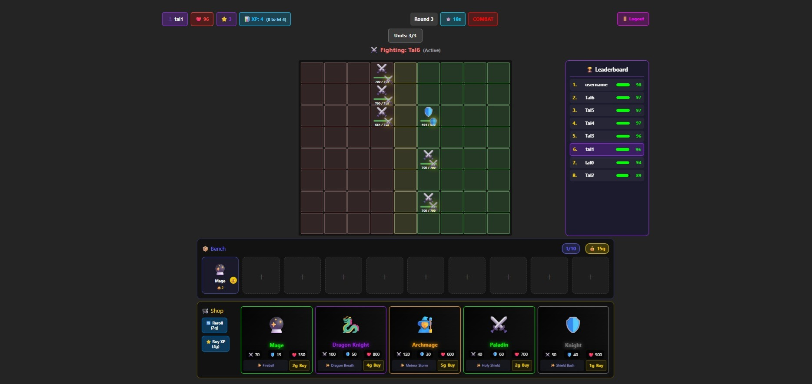
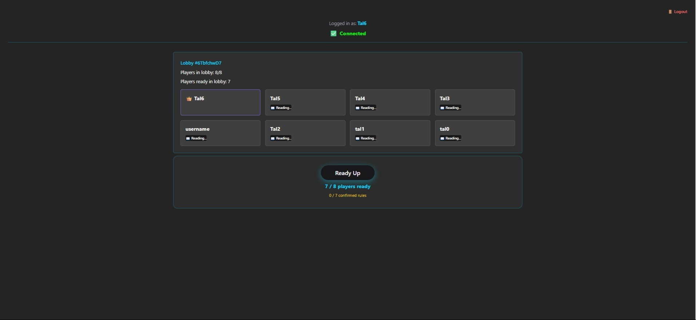
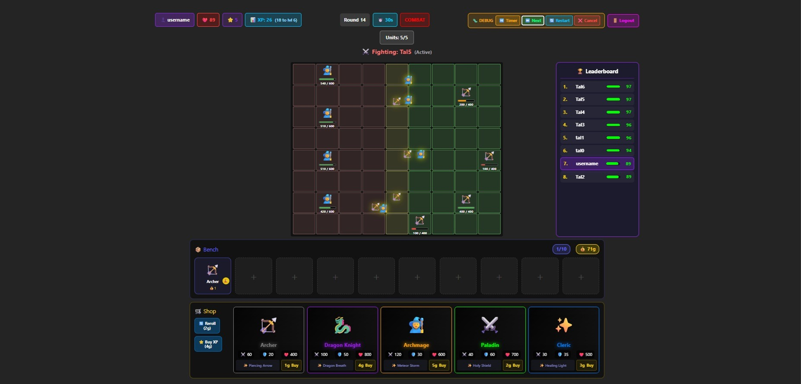
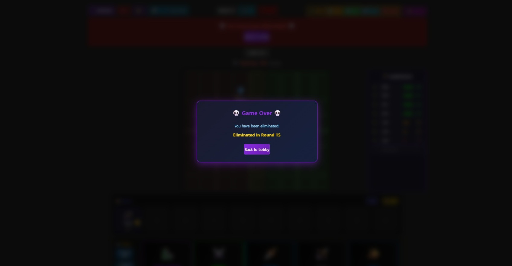

# Auto Chess Arena

A real-time multiplayer auto-battler game supporting up to 8 concurrent players. Built with React, Node.js, and Colyseus.


## Screenshots

| Gameplay | Lobby |
|----------|-------|
|  |  |

| Late Game Combat | Elimination |
|-----------------|-------------|
|  |  |

## Features

- **Real-time Multiplayer** - 8 players compete simultaneously with WebSocket synchronization
- **Smart Matchmaking** - Intelligent opponent pairing that prevents repeat matchups
- **Game State Recovery** - Automatic snapshots to PostgreSQL; games survive server restarts
- **JWT Authentication** - Secure login with refresh tokens and email-based password recovery
- **Economy System** - Gold income, interest, win/loss streaks, and shop rerolls
- **Drag & Drop** - Intuitive unit placement on an 8x9 grid arena

## Tech Stack

| Layer | Technologies |
|-------|--------------|
| **Frontend** | React 18, TypeScript, Vite, PixiJS, Chakra UI, Zustand |
| **Backend** | Node.js, Express, Colyseus (WebSocket), JWT |
| **Database** | PostgreSQL, Redis |
| **DevOps** | Docker, AWS |

## Quick Start

### Prerequisites

- Node.js 18+
- Docker & Docker Compose (for databases)

### Installation

1. **Clone the repository**
   ```bash
   git clone https://github.com/TalVasil/Auto-Chess-Arena.git
   cd Auto-Chess-Arena
   ```

2. **Install dependencies**
   ```bash
   npm install
   cd client && npm install
   cd ../server && npm install
   cd ../shared && npm install
   cd ..
   ```

3. **Set up environment variables**
   ```bash
   cp server/.env.example server/.env
   cp client/.env.example client/.env
   ```
   Edit the `.env` files with your configuration.

4. **Start databases** (requires Docker)
   ```bash
   docker-compose up -d
   ```

5. **Run the development servers**
   ```bash
   npm run dev
   ```

6. **Open your browser**
   - Frontend: http://localhost:3000
   - Backend: http://localhost:2567

## Project Structure

```
Auto-Chess-Arena/
├── client/          # React frontend
│   ├── src/
│   │   ├── components/   # UI components
│   │   ├── network/      # Colyseus client
│   │   └── store/        # Zustand state
├── server/          # Node.js backend
│   ├── src/
│   │   ├── rooms/        # Colyseus game rooms
│   │   ├── services/     # Business logic
│   │   ├── database/     # PostgreSQL repositories
│   │   └── routes/       # REST API endpoints
├── shared/          # Shared types & constants
└── docker-compose.yml
```

## Architecture Highlights

### Real-time Synchronization
Uses Colyseus schema-based state synchronization. All game logic runs server-side; clients receive delta updates via WebSocket.

### Crash Recovery
Game state is snapshotted to PostgreSQL every 5 seconds. If the server restarts, active games resume automatically with a 30-minute reconnection window.

### Combat System
- Positional targeting based on unit proximity
- Speed stat determines attack frequency
- Damage scales with surviving units

## Documentation

- [SETUP.md](./SETUP.md) - Detailed setup instructions
- [GAME_DESIGN.md](./GAME_DESIGN.md) - Game design and mechanics

## Scripts

```bash
npm run dev       # Start development servers
npm run build     # Build for production
npm run lint      # Run ESLint
npm run format    # Format with Prettier
```

## License

MIT License - see [LICENSE](./LICENSE) for details.

## Author

**Tal Vasilisky** - [GitHub](https://github.com/TalVasil) | [LinkedIn](https://www.linkedin.com/in/tal-vasilisky/)
